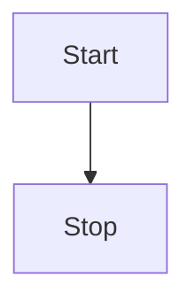

[TOC]

## 新一代的“Markdown”编辑器

## 一、小贴士😀

1. 如果你还不清楚什么是markdown的话请移步[markdown简介](https://markdown.com.cn/cheat-sheet.html#总览), 下面是一些简短的介绍：
   - 左边是源代码
   - 右边是渲染出来的结果
   - 试着在新的一行打出一个# 你好, 在右边就会发现变成标题了！
2. 在新的一行打一个斜杠字符：`/`，即可看到流程图、代码块等快捷提示！
3. 鼠标右键也可发现新大陆( •̀ ω •́ )✧
4. 导出为PDF在右上角更多里，直接按下`Ctrl + P`也可以哦
5. 快捷键完备，试着按下他们吧！
   - `Ctrl + V` 上传复制和截图的JPG、PNG格式图片
   - `Ctrl + Z` 撤回编辑
   - `Ctrl + F` 查找与替换
   - `Ctrl + E/R` 文本居中/右
   - `Ctrl + B` 文本加粗
   - `Ctrl + U` 下划线
   - `Ctrl + I` 文本斜体
   - `Ctrl + 1-4` 1-4级标题
   - `` Ctrl + ` `` 删除线
   - `Ctrl + Q` 同步滚动
   - `Ctrl + Shift + F` 文件管理器
   - `Ctrl + S` 保存
   - `Ctrl + M` 插入一个LaTex代码块
   - `Shift + Alt + F` 格式化Markdown
   - `Ctrl + Alt + V` 语音转文字
   - 更多快捷键，敬请期待...

## 二、下面是一些常用的Makrdown语法

你好，我是表情包😅

我是脚注 [^1] 就是引经据典的那种脚注 [^2]，就是点一下就会跳转到最下面解释的那种！！！

你好，我是带语法提示的LaTex！试着在两个`$$ $$`中间打一个斜杠吧，如果你不清楚LaTex公式的语法，请移步[LaTex公示表](https://blog.csdn.net/Yushan_Ji/article/details/134322574)

$$
\lambda+1=\lambda^3-1
$$

[我是链接](https://bigonion.cn)

## 三、一些扩展的东西✨

对，就在下面，打一个斜杠/，再打flow，回车！

## 四、关于我和这个项目

https://github.com/LiWeny16/MarkdownOnline

[^1]: 就是解释一些东西的脚注啦！
[^2]: 这是第二个脚注！
